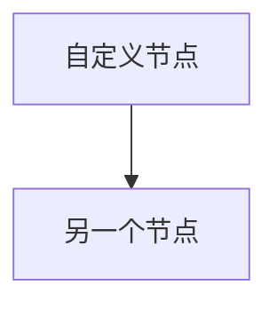

# GitHub Project Analyzer - 完整演示

## 演示结果

已成功完成对 **openclaw/openclaw** 项目的完整分析工作流。

### 输出文件

```
output/
├── data/                           # 原始数据
│   ├── repo_metadata.json          # 仓库元数据 (1.3K)
│   ├── readme.md                   # README 内容 (120K)
│   ├── file_tree.txt               # 文件树 (311K)
│   ├── contributors.txt            # 贡献者列表 (532B)
│   └── issues.json                 # Issues 摘要 (62K)
│
├── docs/                           # 分析报告
│   └── full_report.md              # 完整调研报告 (14K)
│
├── images/                         # 可视化图表
│   ├── architecture.png            # 架构图 (66K)
│   ├── platforms.png               # 平台图 (29K)
│   ├── architecture.mmd            # Mermaid 源文件
│   └── platforms.mmd               # Mermaid 源文件
│
└── video/                          # 视频内容
    ├── slideshow.mp4               # 图片轮播视频 (198K)
    ├── voiceover.mp3               # 配音音频 (214K)
    ├── output_with_audio.mp4       # 完整视频 (462K)
    ├── subtitles.srt               # 字幕文件 (1.2K)
    └── script.txt                  # 配音脚本 (1.3K)

总大小: 1.6MB
```

---

## 工作流说明

### 1. 数据采集 (collector.sh)

```bash
./scripts/collector.sh https://github.com/owner/repo [output_dir]
```

**采集内容：**
- 仓库元数据 (stars, forks, 语言, 协议等)
- README 内容
- 代码文件树
- 贡献者列表
- Releases 历史
- Issues 摘要

### 2. 深度分析

基于采集的数据，AI 生成：
- 项目概述与核心定位
- 需求背景与目标
- 技术架构分析
- 竞品对比分析
- 最佳实践场景
- 落地案例研究
- 优缺点评估

### 3. 文档生成

输出格式：
- **full_report.md** - 完整调研报告
- 包含执行摘要、技术架构、竞品分析等 10 个章节

### 4. 可视化转换

使用 Mermaid 生成图表：
- 架构图
- 平台集成图
- 时间线图
- 对比图

转换为 PNG：
```bash
mmdc -i architecture.mmd -o architecture.png -t dark -b transparent
```

### 5. 视频生成

**步骤：**

1. 创建配音脚本
2. 使用 TTS 生成配音
3. 使用 FFmpeg 合成视频
4. 生成字幕文件

**命令：**
```bash
# 创建视频
ffmpeg -loop 1 -t 18 -i image1.png \
       -loop 1 -t 18 -i image2.png \
       -filter_complex "[0:v][1:v]concat=n=2:v=1:a=0[outv]" \
       -map "[outv]" -c:v libx264 slideshow.mp4

# 添加音频
ffmpeg -i slideshow.mp4 -i voiceover.mp3 \
       -c:v copy -c:a aac output.mp4
```

---

## 使用方法

### 快速开始

```bash
# 1. 进入项目目录
cd /root/.openclaw/workspace-opengl/github-analyzer

# 2. 采集数据
./scripts/collector.sh https://github.com/owner/repo

# 3. AI 分析（在 OpenClaw 中）
"分析 https://github.com/owner/repo 并生成完整报告"

# 4. 生成图表
cd output/images
mmdc -i architecture.mmd -o architecture.png

# 5. 生成视频
ffmpeg -loop 1 -t 18 -i architecture.png \
       -c:v libx264 -pix_fmt yuv420p -r 30 video.mp4
```

### 触发词

在 OpenClaw 中，使用以下触发词：

- "分析 [github url]"
- "调研 [github url]"
- "生成 [github url] 的报告"
- "对比分析 [url1] 和 [url2]"

---

## 技术栈

| 模块 | 工具 | 用途 |
|------|------|------|
| 数据采集 | gh CLI | GitHub API 调用 |
| 数据处理 | jq | JSON 处理 |
| 深度分析 | OpenClaw + LLM | AI 分析 |
| 图表生成 | Mermaid + mmdc | 架构图可视化 |
| 视频合成 | FFmpeg | 图片转视频 |
| 配音生成 | OpenClaw TTS | 文本转语音 |
| 字幕生成 | 手动/SRT | 字幕文件 |

---

## 扩展能力

### 添加新的分析维度

在 `templates/analysis_template.md` 中添加新章节。

### 自定义图表

创建新的 Mermaid 文件：


### 多语言配音

修改 TTS 调用，支持不同语言：
```bash
tts --lang en "English voiceover text"
```

---

## 示例输出

### 调研报告片段

```markdown
## OpenClaw 核心价值

- ✅ 本地优先的 Gateway，数据不出设备
- ✅ 跨平台支持（macOS、iOS、Android、Windows WSL2）
- ✅ 20+ 通讯平台集成
- ✅ 多 Agent 路由和隔离
- ✅ 开源、可自部署
```

### 架构图

[查看 architecture.png](output/images/architecture.png)

### 视频

[查看 output_with_audio.mp4](output/video/output_with_audio.mp4)

---

## 后续优化

### 待实现功能

- [ ] 自动竞品搜索与对比
- [ ] 更多图表类型（时间线、雷达图等）
- [ ] 批量分析多个项目
- [ ] 导出为 PDF
- [ ] Web UI 界面
- [ ] 自动字幕生成（基于配音文本）
- [ ] 多语言版本

### 性能优化

- [ ] 缓存 GitHub API 响应
- [ ] 并行数据采集
- [ ] 增量更新机制

---

*生成时间: 2026-03-04*
*工具版本: GitHub Project Analyzer v1.0.0*
