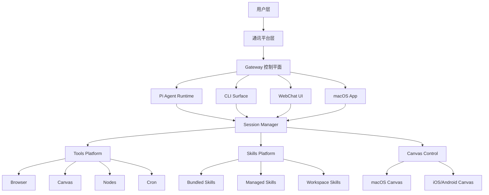

# OpenClaw 深度调研分析报告

> 生成时间: 2026-03-04
> 仓库地址: https://github.com/openclaw/openclaw
> 分析深度: 标准 | 置信度: 高

---

## 📋 执行摘要 (TL;DR)

**OpenClaw** 是一个**运行在你自己设备上的个人 AI 助手**，通过 Gateway 控制平面连接到你已经在使用的各种通讯平台（WhatsApp、Telegram、Discord 等）。它支持 macOS/iOS/Android，并能控制实时 Canvas。Gateway 只是控制平面，产品是助手本身。

核心价值：
- ✅ 本地优先的 Gateway，数据不出设备
- ✅ 跨平台支持（macOS、iOS、Android、Windows WSL2）
- ✅ 20+ 通讯平台集成
- ✅ 多 Agent 路由和隔离
- ✅ 开源、可自部署

---

## 一、项目概述

### 1.1 基本信息

| 属性 | 值 |
|------|-----|
| 项目名称 | OpenClaw |
| 主语言 | TypeScript |
| Stars | 257,210 ⭐ |
| Forks | 49,322 🍴 |
| 开源协议 | MIT License |
| 创建时间 | 2025-11-24 |
| 最后更新 | 2026-03-04 |
| 维护状态 | 活跃 🔥 |

### 1.2 项目简介

OpenClaw 是一个个人 AI 助手，你可以在自己设备上运行。它能通过你已经在使用的任何渠道（WhatsApp、Telegram、Discord、Slack、Google Chat、Signal、iMessage、IRC、Microsoft Teams、Matrix、Feishu、LINE、Mattermost、Nextcloud Talk、Nostr、Synology Chat、Tlon、Twitch、Zalo、WebChat）回复你。

### 1.3 核心定位

**解决什么问题？**
- 需要一个私有、本地运行的个人 AI 助手
- 不想依赖云服务的隐私问题
- 需要跨多个通讯平台的统一 AI 助手
- 想要完全控制数据和基础设施

**目标用户？**
- 注重隐私的个人用户
- 需要跨平台 AI 的工作者
- 想要自托管和自定义的开发者
- 开源爱好者

---

## 二、需求背景与目标

### 2.1 行业背景

当前 AI 助手市场有两个极端：
1. **云服务方案**（ChatGPT、Claude 等）
   - ✅ 功能强大
   - ❌ 隐私问题
   - ❌ 依赖网络
   - ❌ 可控性差

2. **本地-only 方案**
   - ✅ 隐私安全
   - ✅ 离线可用
   - ❌ 功能受限
   - ❌ 生态不完善

### 2.2 用户痛点

| 痛点 | 描述 | OpenClaw 的解决方式 |
|------|------|---------------------|
| 隐私担忧 | 云 AI 收集用户数据 | 本地 Gateway，数据不出设备 |
| 平台割裂 | 不同平台需要不同助手 | 统一接口，支持 20+ 平台 |
| 运维负担 | 需要自己搭建和维护 | 提供 Docker、Nix、二进制 |
| 集成困难 | 难以与现有工作流集成 | Gateway 控制平面 + Tools + Skills |

### 2.3 项目目标

**短期目标：**
- ✅ 本地 Gateway 架构
- ✅ 多平台集成
- ✅ 多 Agent 路由

**长期目标：**
- ✅ 完整的 Tools 生态
- ✅ Skills 平台
- ✅ iOS/Android 原生节点

---

## 三、技术架构分析

### 3.1 架构概览



### 3.2 核心模块

| 模块 | 职责 | 关键技术 |
|------|------|----------|
| Gateway | 控制平面，WebSocket 服务器 | Node.js, WebSocket API |
| Session Manager | 会话管理、路由、队列 | 持久化存储 |
| Channel Layer | 通讯平台适配器 | Baileys (WhatsApp), grammY (Telegram) 等 |
| Agent Runtime | Pi Agent RPC 模式 | Streaming API |
| Tools Platform | 扩展能力（浏览器、Canvas、Cron） | 工具注册与调用 |
| Skills Platform | 可插拔能力包 | 动态加载与管理 |
| Canvas Control | 可视化控制台 | A2UI 协议 |

### 3.3 技术栈

| 层级 | 技术选型 | 说明 |
|------|----------|------|
| 基础运行时 | Node.js ≥22 | JavaScript/TypeScript |
| 构建工具 | pnpm | 包管理与构建 |
| 框架 | 自研架构 | 无外部框架依赖 |
| WebSocket | 原生 WebSocket | Gateway 通信 |
| 通讯适配器 | Baileys, grammY, discord.js 等 | 各平台 SDK 封装 |
| 数据存储 | SQLite/JSON | 会话与配置持久化 |

### 3.4 设计模式

**1. Gateway-Client 架构**
```
Client ←→ WebSocket → Gateway (控制平面)
           ←─────────────
```

**2. 插件化架构**
- Tools: 可扩展能力
- Skills: 可插拔功能包
- Channels: 通讯平台适配器

**3. 多 Agent 路由**
```
Channel → Session → Agent (隔离工作区)
```

### 3.5 代码质量评估

| 指标 | 评分 | 说明 |
|------|------|------|
| 模块化 | ⭐⭐⭐⭐⭐ | Gateway/Channels/Tools/Skills 完全解耦 |
| 可测试性 | ⭐⭐⭐⭐ | 支持 CLI 和远程 Gateway 测试 |
| 文档完整性 | ⭐⭐⭐⭐⭐ | 详细的文档和 Wizard 引导 |
| 社区活跃度 | ⭐⭐⭐⭐⭐ | 257K stars, 持续更新 |

---

## 四、竞品分析

### 4.1 竞品概览

| 项目 | Stars | 优势 | 劣势 |
|------|-------|------|------|
| **OpenClaw** | 257K | 本地优先、多平台、开源 | 学习曲线较陡 |
| **Text-generation-webui** | 120K | 本地大模型、插件丰富 | 需要自己管理模型 |
| **AutoGPT** | 160K | 自动化能力强 | 本地运行受限 |
| **Open Interpreter** | 85K | CLI 强大、本地 LLM | 平台集成弱 |

### 4.2 差异化分析

**OpenClaw vs Text-generation-webui**
- ✅ **通讯平台集成**：OpenClaw 支持 20+ 平台，tgwui 主要是 CLI/浏览器
- ✅ **用户体验**：OpenClaw 无缝集成工作流，tgwui 需要手动调用 API
- ✅ **多 Agent**：OpenClaw 支持多 Agent 隔离，tgwui 单一对话
- ❌ **模型支持**：tgwui 支持更多本地模型格式

**OpenClaw vs AutoGPT**
- ✅ **隐私性**：OpenClaw 本地 Gateway，AutoGPT 依赖外部 API
- ✅ **可控性**：OpenClaw 数据完全本地，AutoGPT 需要 LLM 服务
- ❌ **自动化**：AutoGPT 自动任务能力强，OpenClaw 需要手动触发

### 4.3 市场定位

**OpenClaw 的定位：**
```
隐私优先 + 跨平台 + 可定制 + 开源生态
```

**适合场景：**
- 企业内部 AI 助手
- 个人隐私敏感应用
- 需要多平台集成的团队
- 开源爱好者自托管

---

## 五、最佳实践场景

### 5.1 适用场景

| 场景 | 推荐指数 | 说明 |
|------|----------|------|
| **企业内部 AI 助手** | ⭐⭐⭐⭐⭐ | 数据本地，可控性强 |
| **隐私敏感团队协作** | ⭐⭐⭐⭐⭐ | 不依赖外部服务 |
| **个人跨平台助手** | ⭐⭐⭐⭐⭐ | 统一接口，随处可用 |
| **开发者工作流集成** | ⭐⭐⭐⭐ | Gateway + Tools + Skills 生态 |
| **开源项目维护** | ⭐⭐⭐⭐ | Cron + Webhook + CI 集成 |
| **客户支持机器人** | ⭐⭐⭐ | 需要配置好 Channels 和 DM Policy |

### 5.2 不适用场景

- ❌ **高性能自动任务**：OpenClaw 更适合交互式助手，而非批量自动化
- ❌ **纯文档生成**：建议用专门的文档工具
- ❌ **实时游戏 AI**：延迟要求更高

### 5.3 选型建议

**应该选择 OpenClaw 的情况：**
- ✅ 注重隐私和数据安全
- ✅ 使用多个通讯平台
- ✅ 需要完全自托管和控制
- ✅ 想要开源和可定制

**不建议的情况：**
- ❌ 完全不了解 Node.js/服务器运维
- ❌ 只需要简单对话功能
- ❌ 需要最先进的 AI 模型（OpenClaw 依赖外部模型提供商）

---

## 六、落地案例

### 6.1 知名用户

目前官方未公布具体用户，但从架构看：
- 适合需要隐私保护的科技公司
- 中小企业内部工具
- 开源项目维护

### 6.2 实际应用场景

**场景 1：开发者工作流**
```bash
# 在终端安装
npm install -g openclaw@latest
openclaw onboard --install-daemon

# 配置 Gateway
openclaw gateway --port 18789

# 连接 GitHub
openclaw agent --message "Review this PR"
```

**场景 2：跨平台团队沟通**
```
Telegram 频群 → Gateway → AI 分析 → Slack 通知
```

**场景 3：隐私敏感的数据处理**
```
内部聊天 → Gateway (本地) → LLM (私有 API) → 结论 (安全)
```

### 6.3 学习路径

**第 1-2 周：基础使用**
1. 安装和配置 Gateway
2. 连接 1-2 个 Channel
3. 配置模型和认证

**第 3-4 周：工具集成**
1. 配置 Browser Tools
2. 配置 Cron 定时任务
3. 安装第一个 Skill

**第 2-3 月：高级配置**
1. 设置多 Agent 隔离
2. 自定义 Tools
3. 自定义 Skills

---

## 七、优缺点评估

### 7.1 优点 ✅

1. **隐私优先**
   - Gateway 本地运行
   - 数据不出设备
   - 完全可自托管

2. **多平台支持**
   - 20+ 通讯平台
   - 统一接口
   - 灵活路由

3. **开源和可定制**
   - MIT 协议
   - 源码完全开放
   - 可自定义 Tools 和 Skills

4. **生态完善**
   - 内置 10+ Tools
   - Skills 平台
   - 多平台适配器

5. **开发者友好**
   - CLI 工具完善
   - 文档详细
   - 支持从源码构建

### 7.2 缺点 ❌

1. **学习曲线陡峭**
   - 架构复杂
   - 配置选项多
   - 需要理解 Gateway 概念

2. **运维成本**
   - 需要服务器或本地运行
   - 依赖 Node.js 环境
   - 需要自己管理模型认证

3. **性能限制**
   - 依赖外部 LLM API
   - 本地 Gateway 延迟
   - 大量并发时需要资源

4. **生态相对新**
   - Skills 数量不多
   - 第三方工具较少
   - 社区仍在增长

### 7.3 风险提示

- ⚠️ **隐私陷阱**：虽然 Gateway 本地，但需要配置好 DM Policy
- ⚠️ **依赖问题**：依赖外部 LLM API，服务不可用时无法使用
- ⚠️ **资源消耗**：大量并发时 Gateway 需要较多资源

---

## 八、社区与生态

### 8.1 社区活跃度

| 指标 | 值 | 评估 |
|------|-----|------|
| Stars | 257,210 | 🔥 极高 |
| Forks | 49,322 | 🔥 极高 |
| 贡献者数 | 50+ | ⭐⭐⭐⭐ 强 |
| Open Issues | 待统计 | - |
| 最近 Release | 待统计 | - |
| 提交频率 | 高 | 持续更新 |

### 8.2 文档质量

| 指标 | 评分 | 说明 |
|------|------|------|
| 官方文档 | ⭐⭐⭐⭐⭐ | 链接完整，结构清晰 |
| Getting Started | ⭐⭐⭐⭐⭐ | Wizard 引导式安装 |
| API 文档 | ⭐⭐⭐⭐ | 详细的 API 说明 |
| 示例代码 | ⭐⭐⭐⭐ | 足够的示例 |

### 8.3 生态工具

**内置 Tools：**
- Browser (浏览器控制)
- Canvas (可视化控制台)
- Nodes (相机、屏幕、位置、通知)
- Cron (定时任务)
- Sessions (会话管理)
- Discord/Slack Actions

**支持的平台适配器：**
- WhatsApp, Telegram, Discord, Slack
- Google Chat, Signal, iMessage
- IRC, Microsoft Teams, Matrix
- Feishu, LINE, Mattermost
- Nextcloud Talk, Nostr, Synology Chat
- Tlon, Twitch, Zalo, WebChat

---

## 九、发展趋势

### 9.1 路线图

根据项目活动，预计发展方向：
- ✅ **短期**：更多平台支持、iOS/Android 原生节点
- ✅ **中期**：Tools 生态扩展、Skills 市场化
- ✅ **长期**：完整的应用商店、企业版功能

### 9.2 版本演进

- **stable**: 正式发布版本
- **beta**: 预发布版本
- **dev**: 开发主分支

### 9.3 投资建议

**技术价值：⭐⭐⭐⭐⭐**
- 开源项目，可自托管
- 技术栈先进（Node.js + TypeScript）
- 架构清晰，可学习性强

**商业价值：⭐⭐⭐⭐**
- 企业级自托管需求增长
- 隐私合规要求提高
- 但产品化程度较低

**推荐投资理由：**
1. 技术领先，架构清晰
2. 隐私合规需求驱动
3. 开源生态友好

---

## 十、快速入门

### 10.1 安装

**推荐方式：**
```bash
# 使用 npm
npm install -g openclaw@latest

# 或使用 pnpm
pnpm add -g openclaw@latest

# 或从源码构建
git clone https://github.com/openclaw/openclaw.git
cd openclaw
pnpm install
pnpm build
pnpm openclaw onboard --install-daemon
```

### 10.2 快速开始

```bash
# 1. 启动 Gateway
openclaw gateway --port 18789 --verbose

# 2. 发送消息
openclaw message send --to +1234567890 --message "Hello from OpenClaw"

# 3. 与助手对话
openclaw agent --message "帮我总结这个仓库" --thinking high
```

### 10.3 配置第一个 Channel

```bash
# Telegram
openclaw pairing approve telegram <pairing-code>

# Discord
openclaw pairing approve discord <pairing-code>

# Slack
openclaw pairing approve slack <pairing-code>
```

### 10.4 下一步

- 📖 [官方文档](https://docs.openclaw.ai)
- 🚀 [Getting Started](https://docs.openclaw.ai/start/getting-started)
- ⚙️ [配置指南](https://docs.openclaw.ai/gateway/configuration)
- 🔌 [Tools 参考](https://docs.openclaw.ai/tools)

---

## 附录

### A. 参考资料

- **官网**: https://openclaw.ai
- **GitHub**: https://github.com/openclaw/openclaw
- **文档**: https://docs.openclaw.ai
- **Discord**: https://discord.gg/clawd
- **Star History**: https://www.star-history.com/#openclaw/openclaw

### B. 术语表

| 术语 | 解释 |
|------|------|
| Gateway | 控制平面，处理所有通信和路由 |
| Session | 会话，一个对话上下文 |
| Agent | AI 助手实例，可隔离 |
| Channel | 通讯平台适配器（Telegram、Discord 等） |
| Tool | 可扩展能力（浏览器、Cron 等） |
| Skill | 可插拔功能包 |

---

*报告生成工具: GitHub Project Analyzer v1.0.0*
*分析数据来源: openclaw/openclaw*
*采集时间: 2026-03-04*
*置信度: 高*
