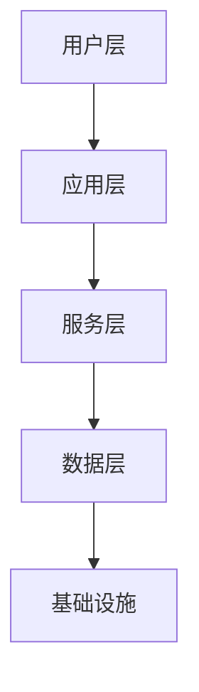

# GitHub 项目深度分析模板

## 分析说明
此模板用于生成 GitHub 项目的深度分析报告。
AI Agent 将根据采集的数据填充各部分内容。

---

# {{PROJECT_NAME}} 深度调研分析报告

> 生成时间: {{GENERATED_AT}}
> 仓库地址: {{REPO_URL}}

---

## 📋 执行摘要 (TL;DR)

<!-- 200字以内的项目核心价值概述 -->

---

## 一、项目概述

### 1.1 基本信息

| 属性 | 值 |
|------|-----|
| 项目名称 | {{PROJECT_NAME}} |
| 主要语言 | {{PRIMARY_LANGUAGE}} |
| Star 数 | {{STARS}} |
| Fork 数 | {{FORKS}} |
| 开源协议 | {{LICENSE}} |
| 创建时间 | {{CREATED_AT}} |
| 最后更新 | {{UPDATED_AT}} |
| 维护状态 | {{MAINTENANCE_STATUS}} |

### 1.2 项目简介

<!-- 基于 README 和 description 的项目介绍 -->

### 1.3 核心定位

<!-- 项目解决什么问题？目标用户是谁？ -->

---

## 二、需求背景与目标

### 2.1 行业背景

<!-- 该项目所处领域的发展趋势和痛点 -->

### 2.2 用户痛点

<!-- 项目要解决的核心问题 -->

### 2.3 项目目标

<!-- 项目的短期和长期目标 -->

---

## 三、技术架构分析

### 3.1 架构概览



### 3.2 核心模块

<!-- 项目的主要模块及其职责 -->

| 模块 | 职责 | 关键文件 |
|------|------|----------|
| 模块A | ... | ... |

### 3.3 技术栈

| 层级 | 技术选型 | 说明 |
|------|----------|------|
| 前端 | ... | ... |
| 后端 | ... | ... |
| 数据库 | ... | ... |
| 部署 | ... | ... |

### 3.4 设计模式

<!-- 项目中使用的核心设计模式 -->

### 3.5 代码质量评估

<!-- 基于文件结构的代码组织评估 -->

---

## 四、竞品分析

### 4.1 竞品概览

| 项目 | Stars | 优势 | 劣势 |
|------|-------|------|------|
| {{PROJECT_NAME}} | {{STARS}} | ... | ... |
| 竞品A | ... | ... | ... |
| 竞品B | ... | ... | ... |

### 4.2 差异化分析

<!-- 本项目与竞品的核心差异 -->

### 4.3 市场定位

<!-- 在竞争格局中的位置 -->

---

## 五、最佳实践场景

### 5.1 适用场景

| 场景 | 推荐指数 | 说明 |
|------|----------|------|
| 场景A | ⭐⭐⭐⭐⭐ | ... |
| 场景B | ⭐⭐⭐⭐ | ... |

### 5.2 不适用场景

<!-- 明确项目不适合的场景 -->

### 5.3 选型建议

<!-- 什么情况下应该选择这个项目 -->

---

## 六、落地案例

### 6.1 知名用户

<!-- 使用该项目的知名公司或项目 -->

### 6.2 实际案例

<!-- 具体的落地应用案例 -->

### 6.3 学习路径

<!-- 从入门到精通的学习建议 -->

---

## 七、优缺点评估

### 7.1 优点 ✅

1. ...
2. ...
3. ...

### 7.2 缺点 ❌

1. ...
2. ...
3. ...

### 7.3 风险提示

<!-- 使用该项目可能面临的风险 -->

---

## 八、社区与生态

### 8.1 社区活跃度

| 指标 | 值 | 评估 |
|------|-----|------|
| 贡献者数 | {{CONTRIBUTORS}} | ... |
| Open Issues | {{OPEN_ISSUES}} | ... |
| 最近 Release | {{LAST_RELEASE}} | ... |
| 提交频率 | ... | ... |

### 8.2 文档质量

<!-- 文档完整性、可读性评估 -->

### 8.3 生态工具

<!-- 周边工具、插件、扩展 -->

---

## 九、发展趋势

### 9.1 路线图

<!-- 项目未来发展方向 -->

### 9.2 版本演进

<!-- 主要版本的变化趋势 -->

### 9.3 投资建议

<!-- 是否值得投入时间学习/使用 -->

---

## 十、快速入门

### 10.1 安装

```bash
# 安装命令
```

### 10.2 Hello World

```bash
# 最简单的使用示例
```

### 10.3 下一步

<!-- 推荐的学习资源 -->

---

## 附录

### A. 参考资料

- [官方文档]({{REPO_URL}})
- [GitHub 仓库]({{REPO_URL}})

### B. 术语表

| 术语 | 解释 |
|------|------|
| ... | ... |

---

*报告生成工具: GitHub Project Analyzer v1.0.0*
*分析深度: 标准 | 置信度: 高*
